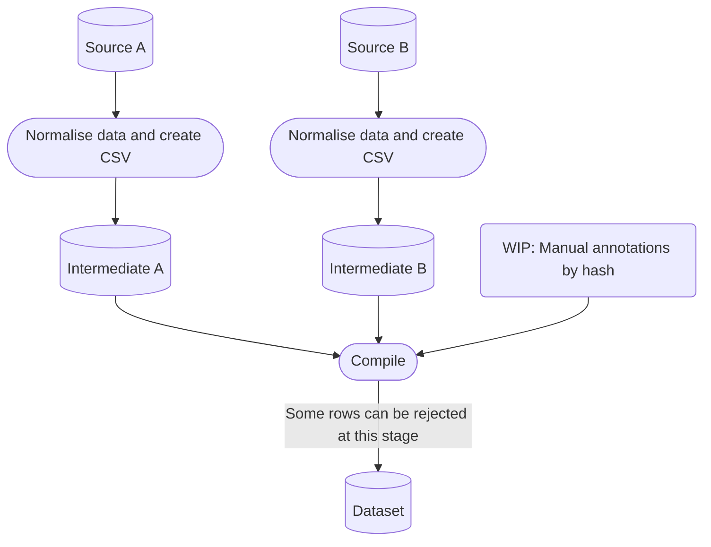

# Audio Data Importers
> A collection of data importers for various audio sources. A loose manual data pipeline.


## Install

`pip install dataimporters`

### Downloading Audio Sources

The audio sources have to be provided manually (for now).  
The scripts expect a data directory containing the audio folders:  
```
root
 |- data
      |- original (where you have to place the soundbanks)
      |- intermediate (generated)
      |- dataset (generated)
```

## How to use

To create a new dataset package, we simply:  
1. import the `Dataset`,  
1. give it the sources we'd like to include and the path to our data,  
1. call `Dataset.compile`

The library is flexible, but here's the simplest and most common action we perform:

```python
#hide_output
from DataImporters.dataset import Dataset

DATA_PATH = "data/"
SOURCES = [
    "space_divers_mini",
    "footsteps_one_ppsfx_004",
    "footsteps_two_ppsfx_008",
    "edward_v1.1"
]

metadata = Dataset(SOURCES, DATA_PATH).compile()
```

`Dataset.compile` will return the newly created metadata _(which has already been saved to `DATA_PATH`)_.  

We can use it to confirm we did indeed copy all files. Since the metadata aggregates all the source metadata, if a file is missing, it will still be in the metadata.  
On the other hand, this will also let us know when a file has been deleted from the source, but still exists in the dataset folder.  

```python
import os
assert len(os.listdir(os.path.join(DATA_PATH, "dataset/audio/"))) == len(metadata)
```

If the assertion fails, this could be due to:  
* Genuine failure to copy  
* Some files in the target folder need deleting  
  * Please delete them, no code yet
* Hash conflict (same content from different sources)  
  * In this case, we must debug the sources and make sure there are no duplicates

## Dataset structure

See [Dataset README](data/dataset/README.md).

## Pipeline



Each loader outputs:  
* a CSV, which is then compiled into a single metadata.csv  
* the files into an intermediate folder  

The process above is done so that:  
* Each notebook is independent  
* We can easily compile a final dataset with different sources  
* Easier to make the split consistent across runs  
